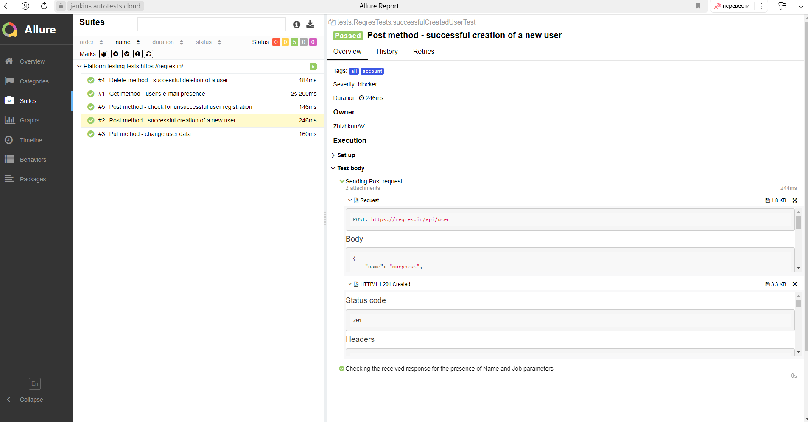
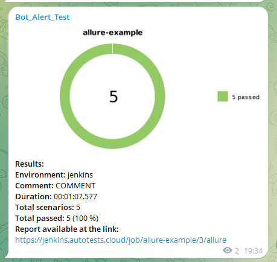

# Reqres API Testing Automation Project

## :man_student:: Content:

- <a href="#tools"> Technologies and tools</a>
- <a href="#checking"> Implemented checks</a>
- <a href="#console"> Running tests from the terminal</a>
- <a href="#jenkins"> Build in Jenkins</a>
- <a href="#allureReport"> Allure report</a>
- <a href="#allure"> Integration with Allure TestOps</a> 
- <a href="#tg"> Notifications in Telegram using a bot</a>
---

## 🔨 Technologies and tools:

| Java                                                                                                    | IntelliJ     Idea                                                                                              | GitHub                                                                                                    | JUnit 5                                                                                                          | Gradle                                                                                                    | Rest Assured                                                                                                        | Allure   Report                                                                                                        | Jenkins                                                                                                         | Jira                                                                                                                                   | Telegram                                                                                                           |                                                                                               Allure   TestOps |
|:--------------------------------------------------------------------------------------------------------|-------------------------------------------------------------------------------------------------------------------|-----------------------------------------------------------------------------------------------------------|------------------------------------------------------------------------------------------------------------------|-----------------------------------------------------------------------------------------------------------|---------------------------------------------------------------------------------------------------------------------|---------------------------------------------------------------------------------------------------------------------------|-----------------------------------------------------------------------------------------------------------------|----------------------------------------------------------------------------------------------------------------------------------------|--------------------------------------------------------------------------------------------------------------------|------------------------------------------------------------------------------------------------------------------:|
|  |  |  |  |  |  |  |  |  |  |  |

Autotests are written in `Java` using `JUnit 5`, `Selenide`, `Rest-Assured`. The project builder is `Gradle`. For remote launch, a task has been implemented in `Jenkins` with the generation of `Allure-report` and
sending results to the `Telegram channel` using a bot. Integration with `Allure TestOps` and `Jira` has also been implemented.

---

## :male_detective:: Implemented checks

- ✓ Get method - user's e-mail presence.
- ✓ Put method - change user data
- ✓ Post method - successful creation of a new user
- ✓ Delete method - successful deletion of a user
- ✓ Method Post - Check for unsuccessful user registration

### Running tests locally from the terminal
`gradle clean test`

---

### Test launch options

You can choose one of three test suites to run:

---

## </a> Сборка в <a target="_blank" href="https://jenkins.autotests.cloud/job/zhizhkunav_restapi/"> Jenkins </a>
To start the build, go to the <code> sectionAssemble with the </code> parameters, select the necessary parameters and click the <code> buttonBuild </code>.

After the assembly is completed, the Allure Report and Allure TestOps icons will appear in the Assembly History block next to the assembly number, clicking on which will open a page with the generated html report and test documentation, respectively.

---

##  [Allure](https://jenkins.autotests.cloud/job/zhizhkunav_restapi/allure/) report

### 🖨️ The main page of the report

### 📄 Test cases

---

##  </a>Integration with<a target="_blank" href="https://allure.autotests.cloud/launch/40027/tree?search=W3siaWQiOiJzdGF0dXMiLCJ0eXBlIjoidGVzdFN0YXR1c0FycmF5IiwidmFsdWUiOlsicGFzc2VkIl19XQ%3D%3D&treeId=0"> Allure TestOps</a>
The statistics of the number of tests are visible on the *Dashboard* in <code>Allure TestOps</code>. New tests, as well as the results of the run, are received by integration every time the build is started.

## 🖨️ The main page of the report

---
#### The content of the task

- :heavy_check_mark: Target
- :heavy_check_mark: Tasks to complete
- :heavy_check_mark: Test cases from Allure TestOps
- :heavy_check_mark: The result of the test run in Allure TestOps

---

##  Notifications in Telegram chat with a bot

After the build is completed, a special bot created in <code>Telegram</code> automatically processes and sends a message with a test run report.

### Notification from correspondence with a chatbot

